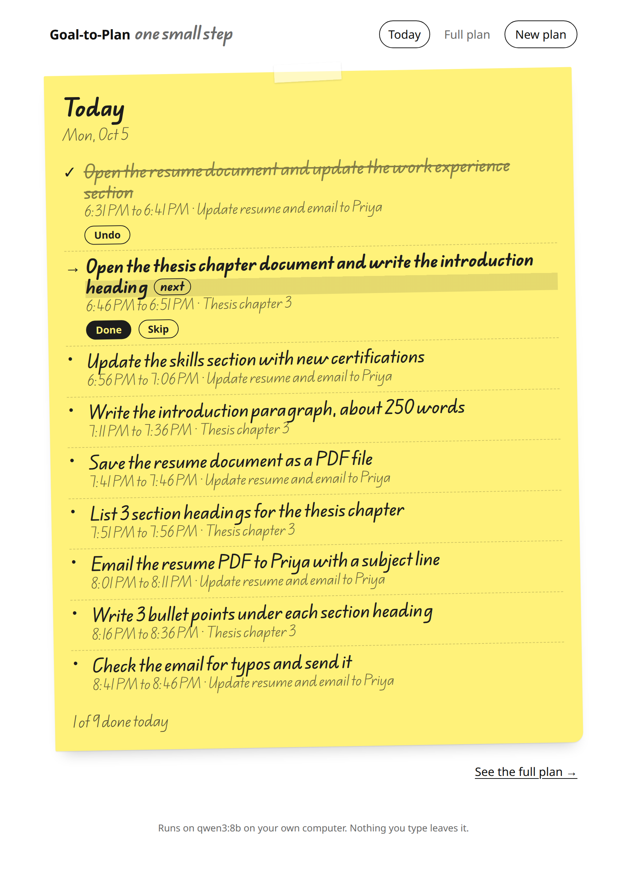
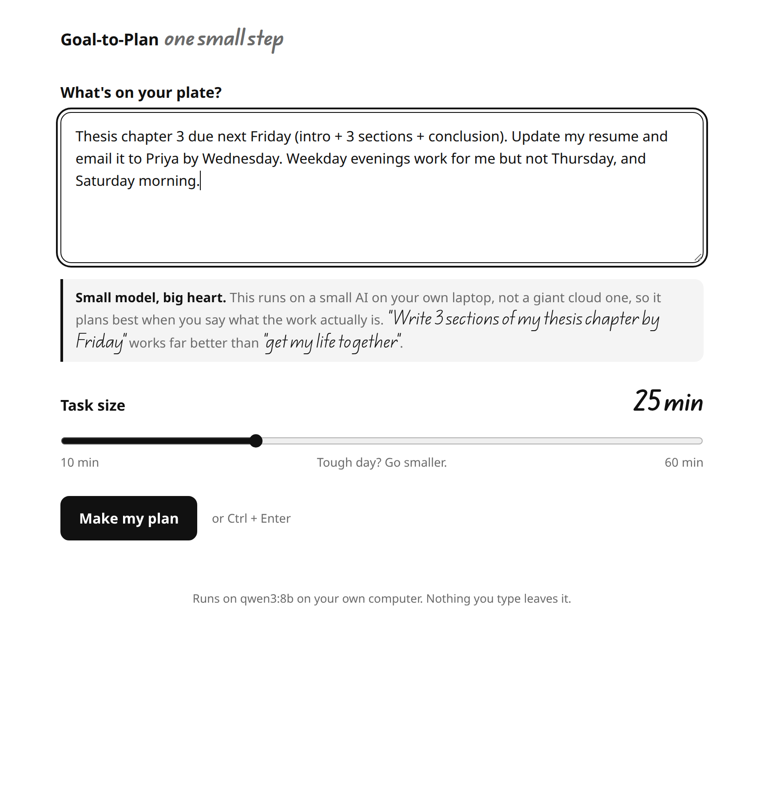
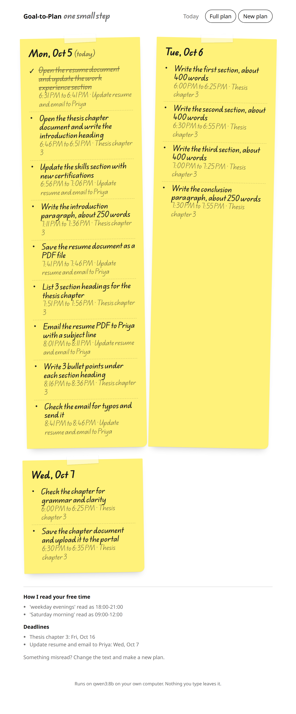
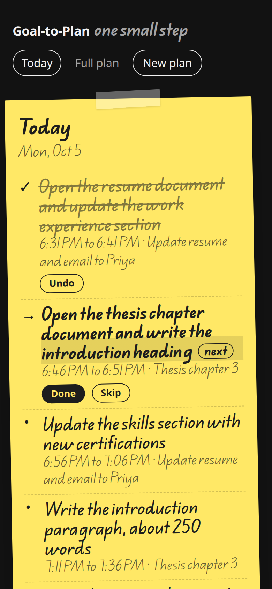
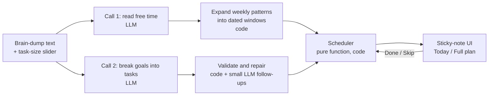

# Goal-to-Plan · *one small step*

**Type out everything on your plate. Get back tiny, concrete steps, scheduled into your free time, on a sticky note that shows only today.**

A private planner that runs an open-weight AI model **on your own computer**. Built for the [DEV Hacktoberfest 2026 Weekend Challenge](https://dev.to) (theme: *Build for a Friend*), for one friend who gets overwhelmed when a big piece of work lands.

**Live app:** https://meetpatel2209.github.io/HacktoberFest2026/DevChallenge1/ (needs [Ollama](#setup) running on your machine, see below)



---

## Contents

- [The problem](#the-problem)
- [What it does](#what-it-does)
- [Why a local, open model](#why-a-local-open-model)
- [How it works](#how-it-works)
- [Choosing the model](#choosing-the-model)
- [Setup](#setup)
- [Using it](#using-it)
- [Project structure](#project-structure)
- [Tests](#tests)
- [Known limits](#known-limits)
- [What's next](#whats-next)
- [Credits](#credits)

---

## The problem

The real problem isn't scheduling. It's **overwhelm**. When "finish thesis chapter 3" lands, the hard part is that there are too many decisions before the first one: where to start, how long it will take, when to do it. So nothing starts.

Every design choice in this app tries to **reduce decisions and shrink the visible size of the work**, rather than add features:

| Design choice | Why |
|---|---|
| One text box, plain language | No forms, no settings pages, no onboarding. |
| **Task-size slider** next to the box (10–60 min, default 25) | Chosen per plan, so a tough day can get 15-minute tasks. |
| **The first step of every goal is tiny** (10 min or less) | Starting is the main blocker. "Open the chapter 3 file and type the heading" is easy to begin. |
| **Today view by default** | You see today's note, not the whole mountain. The full plan is one click away. |
| Only the **next** task has buttons | One decision at a time: Done or Skip. |
| Skip re-plans quietly | No overdue list, no red, no guilt. A skipped task moves to later. |
| Daily cap of 120 minutes | A day packed with small tasks is still overwhelming. |
| "Didn't fit this week" note | Honest instead of cramming. Never squeezes. |

## What it does



1. **You write a brain-dump** of goals, deadlines and free time, e.g. *"Thesis chapter 3 due next Friday (intro + 3 sections + conclusion). Update my resume and email it to Priya by Wednesday. Weekday evenings work for me but not Thursday, and Saturday morning."*
2. **The model reads your free time** (*weekday evenings → 18:00–21:00*) and **breaks each goal into concrete steps** (*"Write the introduction paragraph, about 250 words"*, not *"work on thesis"*).
3. **Plain code checks and fixes the model's answer**: caps task size, makes first steps tiny, removes made-up deadlines, makes sure everything is in English.
4. **A deterministic scheduler** places the steps into your free time, respecting dependencies, deadlines, a 5-minute buffer and the daily cap.
5. **You get yellow sticky notes**: Today by default, and a full plan with one note per day.



Everything is saved in your browser (`localStorage`). There are no accounts and no server. Dark mode follows your system.



## Why a local, open model

The challenge asks for open-source AI at the core. Here that isn't just a rule to follow, it's the reason the app can exist:

- **Privacy.** A brain-dump is personal: deadlines, worries, family errands. With a local model, **nothing you type is sent to an AI provider**. Inference runs on your own GPU through [Ollama](https://ollama.com).
- **Free to run.** No API key, no usage bill, no account.
- **Swappable.** The app talks to the model through one small adapter (`complete(messages, schema)`), so a different open model, or an in-browser runtime like WebLLM later, is a drop-in change.

**What does touch the network, to be honest about it:**
- Downloading Ollama and the model, once.
- Loading the web page from GitHub Pages (or `npm install` if you run it yourself).

The handwriting font is bundled with the app, so no request goes to Google Fonts. After that, planning works with no network at all.

## How it works

The core idea: **the model does the fuzzy work** (understanding plain language, breaking goals down) and **plain, tested code does everything exact** (time arithmetic, size limits, scheduling). Small models are unreliable at date maths and will double-book time slots, so they never do either.



There are exactly **two main model calls**, each constrained by a JSON schema passed to Ollama's `format` parameter. The model's output *must* match the schema, which makes parsing reliable even for a small model.

### Call 1: free time (`src/llm/availability.js`)

The model returns **weekly patterns**, not dates:

```json
{
  "assumptions": ["'weekday evenings' read as 18:00-21:00"],
  "windows": [{ "days": ["Mon", "Tue", "Wed", "Fri"], "date": null, "start": "18:00", "end": "21:00" }]
}
```

Code expands these into real dated windows for the next 7 days. The `assumptions` are shown under the plan, so a misread is easy to spot. If no free time is mentioned, the app plans 18:00–21:00 and says so.

### Call 2: break goals into tasks (`src/llm/prompts.js`, `src/llm/schemas.js`)

```json
{
  "goals": [{ "id": "g1", "title": "Thesis chapter 3", "deadlineText": "due next Friday",
              "deadline": "2026-10-16", "estimatedMinutes": 240 }],
  "tasks": [{ "id": "t1", "goalId": "g1", "isFirstStep": true,
              "title": "Open the thesis chapter document and write the introduction heading",
              "minutes": 5, "dependsOn": [] }]
}
```

A few prompt-engineering tricks that made a real difference with an 8B model:

- **A calendar instead of date arithmetic.** The prompt includes a list of the next 35 days, grouped as *This week / Next week / Later*. The model copies a date instead of calculating "next Friday".
- **Evidence before answers.** Each goal must quote the words that state its deadline (`deadlineText`) *before* giving the date. Code then checks that the quote really appears in your text, and **drops any deadline it can't find**, so the model can't invent deadlines.
- **Size the goal first.** `estimatedMinutes` comes before the tasks, so the model commits to "a thesis chapter takes about 4 hours" and writes enough steps to cover it.
- **Field order steers generation.** `isFirstStep` comes before `title`, so the model knows it's writing the tiny step before it writes it.
- **Examples over rules.** Small models copy examples far more reliably than they follow instructions. Several fixes were a better example, not another rule.

### Validation: code enforces what the prompt asks (`src/validate.js`)

The prompt *asks* for small tasks; the code *makes sure*:

1. **Shape check.** If the answer doesn't match the schema, retry once with the errors as feedback, then show a friendly error.
2. **Deadline evidence.** Drop deadlines whose quote isn't in the brain-dump.
3. **Dependency cleanup.** Remove references to unknown tasks and break cycles.
4. **Size cap.** Any task longer than the slider value goes back to the model: *"split this into steps of at most N minutes"*. After 2 rounds, code splits it into equal parts.
5. **Tiny first step.** If a goal's first step is over 10 minutes, the model is asked for a tiny step to put *in front of it*, and the original task is kept. Placeholder answers like "Tiny Step" are rejected.
6. **English only.** Titles in Hindi script or with common Hinglish words are sent back for an English rewrite, and the rewrite is only accepted if it passes the same check.
7. Every task is at least 5 minutes.

### Scheduler (`src/scheduler.js`)

`schedule(tasks, freeWindows, now, options) → { placements, unscheduled }`. A **pure function**: no model, no DOM, no clock of its own. That makes it easy to test.

- Topological order by dependencies; goals are **round-robined** so one evening isn't all one goal.
- Each task goes in the **earliest free slot** at or after now and after its dependencies, with a **5-minute buffer**.
- **Daily cap** of 120 minutes; a free window crossing midnight is split correctly.
- A task that can't finish **before its goal's deadline**, or within the 7-day horizon, goes to *Didn't fit this week*.
- **Done** tasks keep their slot. **Skip** re-plans every not-done task from now, and the skipped task can't land back in its old slot.
- If you open the app after a slot you missed, it **re-plans on load**, quietly.
- Real-minute arithmetic, so daylight-saving changes don't break anything.

### Model adapter (`src/llm/adapter.js`)

One function, `complete(messages, schema)`, which `POST`s to Ollama's `http://localhost:11434/api/chat` with:

- `format: schema`: constrained JSON output
- `temperature: 0`: the same input gives the same plan
- `num_ctx: 8192`: Ollama's default 4096 is too tight for a 3-goal plan
- `num_predict: 3000`: a model stuck repeating itself is cut off in about 90 seconds instead of hanging
- `think: false` for Qwen3: its "thinking out loud" mode is slow and unnecessary with a schema

Errors come back typed (`unreachable`, `model-missing`, `timeout`, `bad-output`), so the UI can say exactly what to do.

## Choosing the model

Two 7–8B open-weight models were compared on the same five realistic brain-dumps (`prompt-lab/cases.js`):

1. a single vague goal
2. three goals with different deadlines
3. loose availability ("weekday evenings, not Wednesday")
4. a goal the user had already broken down
5. Hinglish (Hindi typed in English letters)

| | **qwen3:8b** ✅ chosen | llama3.1:8b |
|---|---|---|
| Cases that produced a plan | **5 / 5** | 4 / 5 |
| Got stuck repeating itself | **0 times** | 3 times |
| Deadlines exactly right | **4 / 5** | 3 / 5 |
| Task titles | Concrete ("Write 300 words for the first main point") | Often vague ("Start working on the DSA assignment") |
| Splits big work | Yes | Weakly |
| Time per plan (RTX 4060 laptop GPU) | 7–30 s | 10–29 s when it works, ~90 s per loop |

Qwen3 8B (Apache 2.0) runs entirely on an 8 GB laptop GPU at about **39 tokens/second**, so a full plan takes **15–30 seconds**.

Every model reply, before and after the prompt changes, is saved in [`prompt-lab/results/`](prompt-lab/results/). The prompt design notes are in [`prompt-lab/call2-claude.md`](prompt-lab/call2-claude.md). A ChatGPT-generated alternative that was compared against it is in [`prompt-lab/call2-chatgpt.md`](prompt-lab/call2-chatgpt.md).

To re-run the comparison yourself (Ollama must be running and the model pulled):

```bash
node prompt-lab/run-cases.mjs qwen3:8b          # all 5 cases
node prompt-lab/run-cases.mjs llama3.1:8b 2 5   # only cases 2 and 5
```

The runner prints each plan, flags vague titles, checks the deadlines, and reports what code had to fix.

## Setup

### What you need

| | Recommended | Minimum |
|---|---|---|
| GPU | NVIDIA with **8 GB VRAM** (e.g. RTX 4060), or Apple Silicon | none: runs on CPU, much slower |
| RAM | 16 GB | 16 GB |
| Disk | ~8 GB free (Ollama ~2–4 GB + model 5.2 GB) | |
| Browser | Chrome, Edge or Firefox | Safari may block a web page from reaching `localhost` |

### 1. Install Ollama

Ollama downloads open models and runs them locally, behind a small API on `localhost:11434`.

- **Linux:** `curl -fsSL https://ollama.com/install.sh | sh`. It installs a background service that starts at boot. If you have an NVIDIA GPU with drivers installed, it's picked up automatically.
- **macOS / Windows:** download the app from [ollama.com/download](https://ollama.com/download).

Check it's running:

```bash
curl http://localhost:11434/api/version
```

### 2. Download the model

```bash
ollama pull qwen3:8b      # ~5.2 GB, once
ollama run qwen3:8b "Say hi in five words" --think=false   # quick check
ollama ps                 # PROCESSOR should say "100% GPU" if you have one
```

### 3a. Use the hosted app (no Node.js needed)

The page on GitHub Pages runs in your browser and talks to **your** Ollama. Ollama only accepts requests from `localhost` pages by default, so it has to be told to trust this site once:

**Linux (systemd):**

```bash
sudo systemctl edit ollama
```

Add these lines, save, then restart:

```ini
[Service]
Environment="OLLAMA_ORIGINS=https://meetpatel2209.github.io"
```

```bash
sudo systemctl restart ollama
```

**macOS:**

```bash
launchctl setenv OLLAMA_ORIGINS "https://meetpatel2209.github.io"
```

Then quit and reopen the Ollama app.

**Windows:** add a user environment variable `OLLAMA_ORIGINS` = `https://meetpatel2209.github.io`, then quit and reopen Ollama.

Open **https://meetpatel2209.github.io/HacktoberFest2026/DevChallenge1/**. Chrome or Edge may ask once to *allow this site to access devices on your local network*. Click **Allow**: that's the page reaching your own Ollama.

> **Why this is safe:** the setting only lets that one site use your local model. Any other website still gets `403 Forbidden`. You can check:
> `curl -i -X OPTIONS localhost:11434/api/chat -H "Origin: https://example.com" -H "Access-Control-Request-Method: POST"`

### 3b. Or run it yourself

Requires Node.js 20.19+ or 22.12+ (developed on Node 24).

```bash
git clone https://github.com/MeetPatel2209/HacktoberFest2026.git
cd HacktoberFest2026/DevChallenge1
npm ci
npm run dev        # http://localhost:5173 (localhost needs no OLLAMA_ORIGINS change)
```

To try another pulled model without changing code, add it to the URL: `http://localhost:5173/?model=llama3.1:8b`

Other commands:

```bash
npm test           # 143 unit tests
npm run build      # static site in dist/
```

## Using it

- **Say what the work actually is.** This is a small model on a laptop, not a giant cloud model. *"Write 3 sections of my thesis chapter by Friday"* works far better than *"get my life together"*. The app says this right under the text box.
- **Mention deadlines and free time in your own words**: "by Monday", "kal tak", "free after 7 on weekdays", "Saturday morning". Hindi and Hinglish input are understood, and tasks always come back in English.
- **Tough day?** Slide the task size down to 10–15 minutes.
- **Done** ticks the next task. **Skip** moves it to later without fuss. **Undo** reverses a Done.
- Check **"How I read your free time"** and **"Deadlines"** under the full plan. If something's misread, edit the text and press **New plan**.

## Project structure

```
DevChallenge1/
├── index.html
├── src/
│   ├── main.js              # entry: font, styles, adapter, mount
│   ├── planner.js           # app state + actions: createPlan, markDone, skipTask, replan, refreshOnLoad
│   ├── scheduler.js         # pure scheduling function
│   ├── validate.js          # checks and repairs the model's plan
│   ├── storage.js           # localStorage, one versioned key (planner:v1)
│   ├── llm/
│   │   ├── adapter.js       # the only code that talks to a model (Ollama)
│   │   ├── prompts.js       # system prompts, examples, calendar list
│   │   ├── schemas.js       # JSON schemas for constrained output
│   │   ├── availability.js  # Call 1: free time → weekly rules → dated windows
│   │   └── decompose.js     # Call 2: prompt → model → validated plan
│   └── ui/
│       ├── app.js           # plain-DOM UI (no framework); model text is only ever inserted as text
│       └── styles.css       # black / white / grey + yellow sticky notes, light & dark
├── tests/                   # Vitest unit tests
├── prompt-lab/              # model comparison: cases, runner, saved results, prompt design notes
├── docs/screenshots/
└── HANDOFF.md               # the original design brief
```

Deployment: [`.github/workflows/pages.yml`](../.github/workflows/pages.yml) installs dependencies, runs the tests, builds, and publishes to GitHub Pages on every push to `main` that touches `DevChallenge1/`. A failing test blocks the deploy.

## Tests

```bash
npm test
```

**143 tests**, all running without a model. Model calls are replaced with fakes, so the tests are fast and deterministic.

| File | Covers |
|---|---|
| `scheduler.test.js` | empty input, dependency chains, tasks bigger than any window, daily cap, deadlines passed, windows exactly touching, **daylight-saving change** (tests run in `Europe/Berlin`, which falls back on 2026-10-25), re-plan after skip keeps done tasks |
| `validate.test.js` | schema errors and retry, size-cap splitting and fallback, first-step rules, cycle breaking, deadline evidence, English check, placeholder rejection |
| `availability.test.js` | free-time cleanup, weekly expansion, one-off dates, month ends |
| `prompts.test.js` | calendar list, message builders, prompt examples are themselves valid, end-to-end with a fake model |
| `adapter.test.js` | request format, timeouts, cut-off answers, error types, per-model settings |
| `planner.test.js` | create / done / skip / re-plan on load, storage that never throws |

## Known limits

Honest notes from testing with an 8B model:

- **Vague goals give bloated plans.** "Get my life together" produces about 10 generic self-help steps. Prompt changes didn't reliably fix it (one made the model loop), so the UI asks for descriptive input instead.
- **"Next Friday" means the Friday of next week** (Monday to Sunday weeks). On a Monday, "next Friday" is 11 days away, not 4. Check the Deadlines list.
- **Deadline quotes can be shared.** If one sentence holds two goals ("pay the bill and book the doctor by tomorrow"), both may get that deadline.
- **Tasks are often exactly the slider value.** The model tends to fill the limit rather than estimate. Never over it, though.
- **No recurring habits.** "Start a gym routine" becomes the first session, not a weekly repeat.
- **Done early doesn't free the slot.** A task ticked before its time keeps its place in the plan.
- **Times inside the repeated hour on the night the clocks go back** (02:00–03:00) are ambiguous when reloaded. This doesn't affect normal waking hours.
- **Not tested on Safari**, which may block a website from reaching `localhost`.
- **One browser, one device.** The plan lives in that browser's localStorage.

## What's next

- **`.ics` calendar upload:** subtract busy events (including weekly classes or shifts) from free time, entirely in the browser.
- **WebLLM backend:** run the model inside the browser so nothing needs installing (same `complete()` adapter).
- Pick the final name with the friend, and act on their first feedback.

## Credits

- **Model:** [Qwen3 8B](https://ollama.com/library/qwen3) by the Qwen team (Apache 2.0), run with [Ollama](https://ollama.com) (MIT) and its llama.cpp engine.
- **Font:** [Edu QLD Hand](https://fonts.google.com/specimen/Edu+QLD+Hand), © The QLD School Hand Australia Project Authors, SIL Open Font License 1.1, bundled via [Fontsource](https://fontsource.org).
- **Tooling:** [Vite](https://vite.dev), [Vitest](https://vitest.dev), GitHub Actions and Pages.
- **Research behind "concrete step at a set time":** implementation intentions, Gollwitzer & Sheeran (2006), a meta-analysis.
